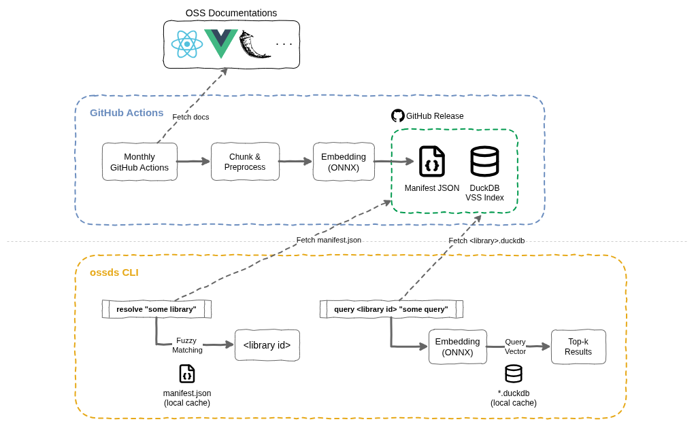

# oss-doc-search-cli

OSS documentation search tool for coding agents. Vector search across library docs using DuckDB VSS.

- **Automated indexing**: Monthly GitHub Actions workflow fetches, chunks, and embeds OSS documentation. Index artifacts distributed via GitHub Releases.
- **Local vector search**: CLI uses cached indexes for vector similarity search with local embedding via ONNX Runtime.
- **Two-step query workflow**: Resolve library name to ID with fuzzy match, then query with library ID + search text.



## Installation

```bash
uv tool install oss-doc-search-cli
```

Or run directly:

```bash
uvx --from oss-doc-search-cli ossds list
```

## Usage

### Step 1: Resolve library name to ID

```bash
ossds resolve next.js
# Output: /vercel/next.js

ossds resolve fasti  # fuzzy match
# Output: /fastify/fastify
```

### Step 2: Query documentation

```bash
ossds query /vercel/next.js "app router setup"
ossds query /fastify/fastify "getting started" --k 10
```

### List available libraries

```bash
ossds list
ossds list --json
```

### Update indexes

```bash
ossds update              # Download manifest
ossds update /vercel/next.js  # Download specific index
ossds update --all        # Download all indexes
ossds update --status     # Show cache status
```

## First Run

Manifest auto-downloads on first use:

```bash
ossds list
# -> Manifest not found. Downloading...
# -> List displayed
```

## Development

```bash
git clone https://github.com/likeablob/oss-doc-search-cli.git
cd oss-doc-search-cli
mise trust
uv sync
uv run pre-commit install

# Run
uv run ossds list

# Linting & Formatting
uv run ruff check .
uv run ruff format .

# Type Checking
uv run ty check src/

# Tests
uv run pytest tests/

# Pin GitHub Actions versions
pinact run
```

## License

- Source code: MIT License
- DuckDB index files: Derived from original documentation, subject to respective licenses
